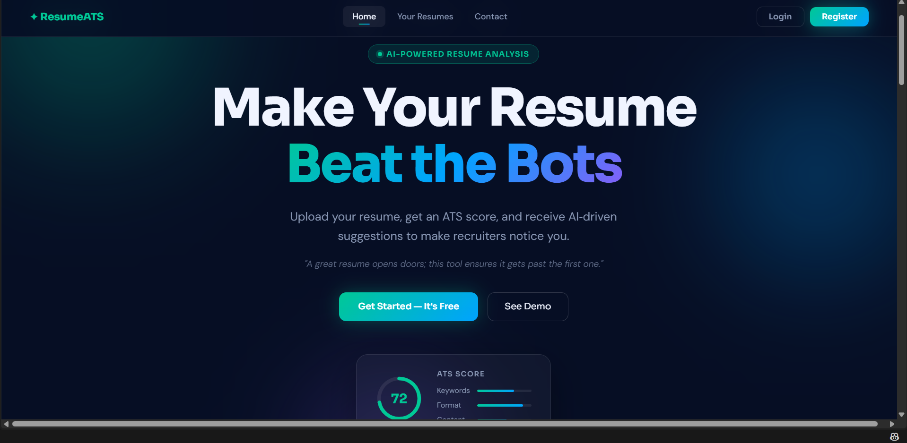
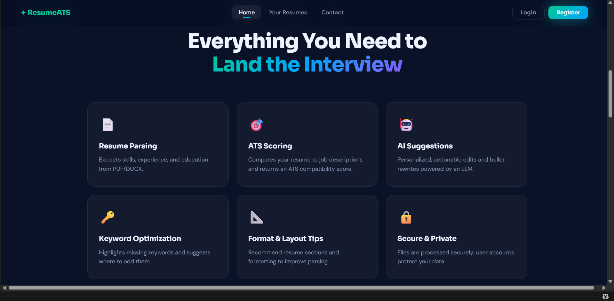
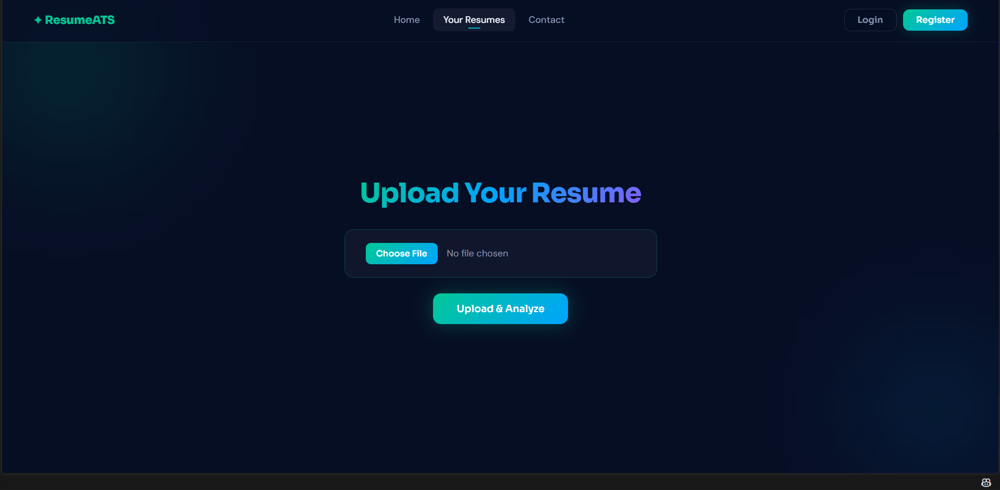
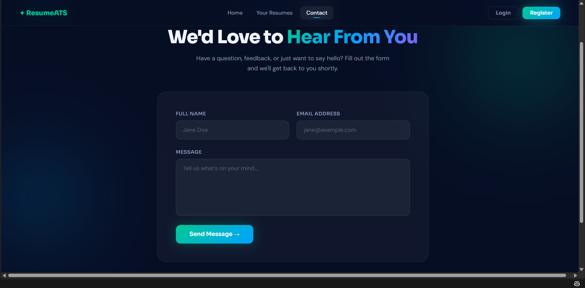
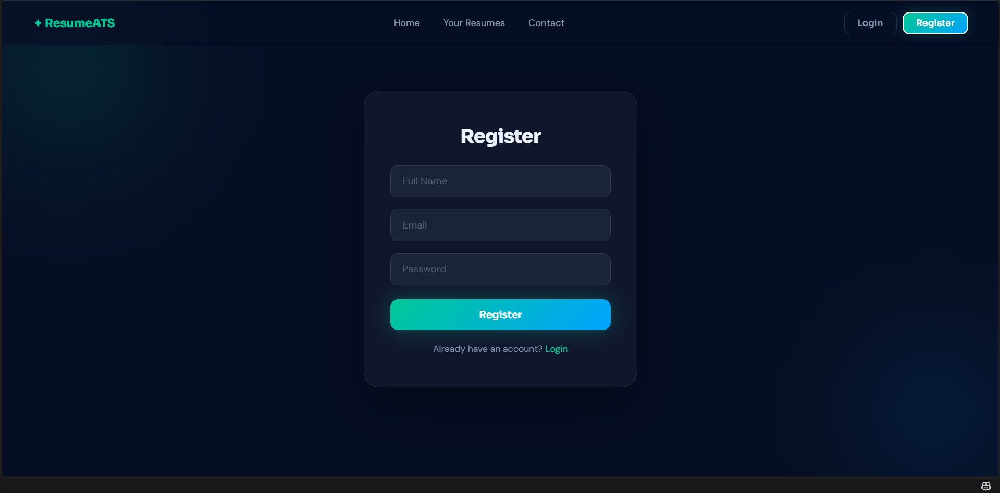

# 🤖 ResumeATS — AI-Powered Resume ATS Analyzer

**ResumeATS** is a full-stack web application that helps job seekers evaluate and improve their resumes for Applicant Tracking Systems (ATS).

Users can create an account, securely log in, upload a PDF resume, extract resume text, calculate an ATS keyword compatibility score, and receive AI-powered recommendations using Google Gemini.

---

## 📌 Problem Statement

A strong resume is not always enough to get an interview. Many companies use Applicant Tracking Systems (ATS) to automatically scan, filter, and rank resumes before recruiters review them.

A resume can be rejected when it:

- Does not contain relevant job-description keywords
- Uses difficult-to-parse formatting
- Misses important technical skills
- Does not sufficiently match the target role

ResumeATS helps users identify these issues before applying.

---

## 💡 Solution

ResumeATS provides an automated workflow:

```text
Upload Resume
      ↓
Extract PDF Text
      ↓
Enter / Compare Job Requirements
      ↓
Extract Keywords
      ↓
Calculate ATS Score
      ↓
Analyze with Gemini AI
      ↓
Display Suggestions & Improvements
```

The application combines traditional keyword-based ATS scoring with AI-powered resume recommendations.

---

# ✨ Features

### 🔐 Authentication

- User registration
- User login
- JWT-based authentication
- Protected resume routes

### 📄 Resume Processing

- Upload PDF resumes
- Validate uploaded files
- Extract text from PDF files
- Process uploaded files using Multer memory storage
- Parse PDF content using `pdfjs-dist`

### 📊 ATS Analysis

- Extract keywords from resume text
- Extract keywords from job descriptions
- Remove duplicate keywords
- Compare resume keywords with job-description keywords
- Calculate ATS compatibility percentage

### 🤖 AI-Powered Analysis

Google Gemini provides:

- Missing skill suggestions
- Resume optimization recommendations
- Actionable improvement suggestions
- Bullet-point improvement ideas
- Job-description alignment suggestions

### 🎨 User Interface

- Modern responsive design
- Dark-themed interface
- Home page
- Features section
- Registration page
- Login page
- Resume upload page
- Contact page
- ATS analysis report modal

---

# 🖥️ Application Screenshots

## 🏠 Home Page



The landing page introduces ResumeATS and provides quick access to resume analysis.

---

## ⚡ Features Section



The features section highlights resume parsing, ATS scoring, AI suggestions, keyword optimization, formatting guidance, and security.

---

## 📄 Resume Upload



Authenticated users can upload a PDF resume and start the analysis process.

---

## 📬 Contact Page



Users can submit their name, email address, and message through the contact interface.

---

## 📝 Registration Page



New users can create an account using their name, email, and password.

---

# 🛠️ Tech Stack

## Frontend

- React.js
- Vite
- React Router
- JavaScript
- HTML5
- CSS3

## Backend

- Node.js
- Express.js
- Mongoose
- JWT
- Multer
- pdfjs-dist

## Database

- MongoDB Atlas

## AI

- Google Gemini API

## Development Tools

- VS Code
- Git
- GitHub
- npm

---

# 🏗️ Architecture

```text
┌───────────────────────────────┐
│        React + Vite           │
│          Frontend             │
│                               │
│  Register | Login | Upload   │
│  Resume | Contact | Report   │
└───────────────┬───────────────┘
                │
                │ HTTP / REST API
                ▼
┌───────────────────────────────┐
│       Node.js + Express       │
│           Backend             │
│                               │
│ Authentication                │
│ Resume Upload                 │
│ PDF Parsing                   │
│ ATS Scoring                   │
│ Gemini AI Analysis            │
└───────────────┬───────────────┘
                │
        ┌───────┴────────┐
        ▼                ▼
┌───────────────┐  ┌────────────────┐
│ MongoDB Atlas │  │ Google Gemini  │
│               │  │      AI        │
│ Users         │  │ Suggestions    │
│ Resumes       │  │ Analysis       │
└───────────────┘  └────────────────┘
```

---

# 📁 Project Structure

```text
resume-ats-analyzer/
│
├── client/
│   ├── src/
│   │   ├── components/
│   │   ├── pages/
│   │   ├── App.jsx
│   │   └── ...
│   ├── public/
│   ├── package.json
│   └── ...
│
├── server/
│   ├── controllers/
│   ├── middleware/
│   ├── models/
│   ├── routes/
│   ├── utils/
│   ├── package.json
│   ├── server.js
│   └── .env
│
├── screenshots/
│   ├── home.png
│   ├── features.png
│   ├── your-resumes.png
│   ├── contact.png
│   └── register.png
│
├── .gitignore
└── README.md
```

> **Note:** `server/.env` and `node_modules/` must never be committed to GitHub.

---

# ⚙️ Prerequisites

Before running the application, install:

- [Node.js](https://nodejs.org/)
- npm
- MongoDB Atlas account
- Google Gemini API key
- Git
- VS Code

---

# 🚀 Installation & Setup

## 1. Clone the Repository

```bash
git clone https://github.com/YOUR_USERNAME/resume-ats-analyzer.git
cd resume-ats-analyzer
```

---

## 2. Backend Setup

Open the server directory:

```bash
cd server
```

Install dependencies:

```bash
npm install
```

---

## 3. Environment Variables

Create a `.env` file inside the `server` directory:

```env
MONGODB_URI=your_mongodb_connection_string
JWT_SECRET=your_jwt_secret
GEMINI_API_KEY=your_gemini_api_key
PORT=5000
```

### ⚠️ Security

Never commit the `.env` file to GitHub.

Never expose:

- MongoDB username/password
- Gemini API key
- JWT secret

---

## 4. Start Backend

```bash
npm start
```

Backend server:

```text
http://localhost:5000
```

---

## 5. Frontend Setup

Open a new terminal and go to the client directory:

```bash
cd client
```

Install dependencies:

```bash
npm install
```

Start the development server:

```bash
npm run dev
```

Frontend:

```text
http://localhost:5173
```

---

# 🔐 Authentication Flow

ResumeATS uses JWT authentication.

### Register

```http
POST /auth/register
```

Creates a new user account.

### Login

```http
POST /auth/login
```

Authenticates the user and returns a JWT token.

The frontend stores the token and sends it with protected API requests.

### Protected Request

```text
Client
  ↓
Authorization: Bearer <JWT>
  ↓
Auth Middleware
  ↓
JWT Verification
  ↓
Protected Controller
```

---

# 📄 Resume Upload Flow

The resume upload process uses `multipart/form-data`.

```text
PDF Resume
    ↓
Multer
    ↓
Memory Buffer
    ↓
Uint8Array
    ↓
pdfjs-dist
    ↓
Extracted Resume Text
```

The application uses Multer memory storage so the uploaded PDF can be processed directly without permanently storing the uploaded file on the server.

---

# 📊 ATS Score Calculation

ResumeATS calculates a keyword-based ATS score.

The formula is:

```text
ATS Score =
(Matching Keywords / Total Unique Job Description Keywords) × 100
```

### Example

```text
Job Description Keywords:
React
Python
JavaScript

Resume Keywords:
React
JavaScript
Node.js

Matching Keywords = 2
Total Unique JD Keywords = 3

ATS Score = (2 / 3) × 100

ATS Score = 67%
```

Duplicate job-description keywords are removed before calculating the score.

---

# 🔎 Keyword Extraction

The application extracts meaningful words from text using a regular expression.

Conceptually:

```text
Resume / Job Description
          ↓
      Lowercase
          ↓
  Extract words with 3+
      characters
          ↓
      Keyword list
```

This keyword list is then used by the ATS scoring system.

---

# 🤖 Gemini AI Analysis

The application sends the resume text and job description to Google Gemini.

Gemini is used to generate structured resume analysis such as:

- Missing skills
- Optimization suggestions
- Resume improvements
- Better bullet points
- Job-specific recommendations

The backend requests a structured JSON response so the frontend can display the analysis in the report modal.

---

# 🔌 API Endpoints

## Authentication

| Method | Endpoint | Description |
|---|---|---|
| POST | `/auth/register` | Register a new user |
| POST | `/auth/login` | Login and receive JWT |

## Resume

| Method | Endpoint | Description |
|---|---|---|
| POST | `/resume/upload` | Upload and parse a PDF resume |
| POST | `/resume/analyze` | Calculate ATS score and generate AI analysis |

Protected endpoints require a valid JWT token.

---

# 🗄️ Database

MongoDB Atlas is used as the application's database.

The project contains models for storing user and resume-related information.

### User

```text
name
email
password
```

### Resume

```text
userId
text
atsScore
suggestions
```

---

# 🔒 Security

The project uses:

- JWT authentication
- Protected API routes
- Environment variables
- MongoDB Atlas
- Server-side API keys
- Authentication middleware

Recommended `.gitignore`:

```gitignore
node_modules/
.env
*.log
dist/
```

---

# 🚀 Deployment

Recommended production architecture:

```text
                    Internet
                       │
                       ▼
              ┌─────────────────┐
              │     Vercel      │
              │ React + Vite    │
              │    Frontend     │
              └────────┬────────┘
                       │
                       │ HTTPS API
                       ▼
              ┌─────────────────┐
              │     Render      │
              │ Node + Express  │
              │     Backend     │
              └───────┬─────────┘
                      │
             ┌────────┴────────┐
             ▼                 ▼
     ┌──────────────┐   ┌──────────────┐
     │ MongoDB Atlas│   │ Gemini API   │
     │   Database   │   │     AI       │
     └──────────────┘   └──────────────┘
```

### Recommended Hosting

| Component | Platform |
|---|---|
| Frontend | Vercel |
| Backend | Render |
| Database | MongoDB Atlas |
| AI | Google Gemini |

---

# 🧪 Current Functionalities

According to the completed project workflow:

- ✅ User registration
- ✅ User login
- ✅ JWT authentication
- ✅ PDF resume upload
- ✅ PDF text extraction
- ✅ Keyword extraction
- ✅ ATS keyword scoring
- ✅ Gemini AI analysis
- ✅ AI suggestions
- ✅ Protected resume routes
- ✅ Resume analysis report
- ✅ Responsive frontend pages

---

# 🔮 Future Improvements

- [ ] Allow users to enter a custom job description
- [ ] Save analysis results permanently in MongoDB
- [ ] Resume analysis history
- [ ] Download ATS reports as PDF
- [ ] Resume templates
- [ ] Job-specific resume optimization
- [ ] Multiple resume comparison
- [ ] Resume analytics dashboard
- [ ] Logout functionality
- [ ] More advanced ATS scoring
- [ ] Resume section-by-section analysis
- [ ] Support for additional resume formats

---

# 🎓 Learning Outcomes

This project demonstrates practical experience with:

- Full-stack web development
- React.js
- Node.js
- Express.js
- MongoDB
- REST APIs
- JWT authentication
- Protected routes
- File uploads
- PDF processing
- Regular expressions
- Keyword matching
- ATS scoring
- AI API integration
- Gemini API
- Environment variable management
- Git and GitHub
- Deployment architecture

---

# 👨‍💻 Author

## Abhinav Raskar

**Full Stack Developer**

Built as a full-stack AI-powered project for resume analysis and job application optimization.

---

# ⭐ Support

If you find this project useful, please consider giving the repository a ⭐ on GitHub.
